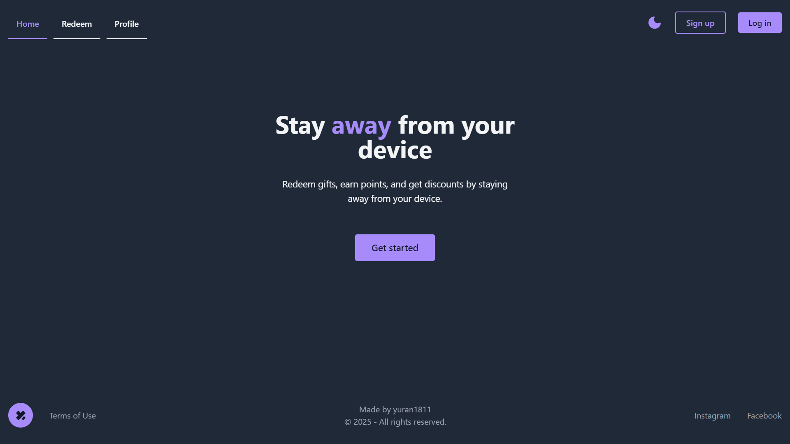
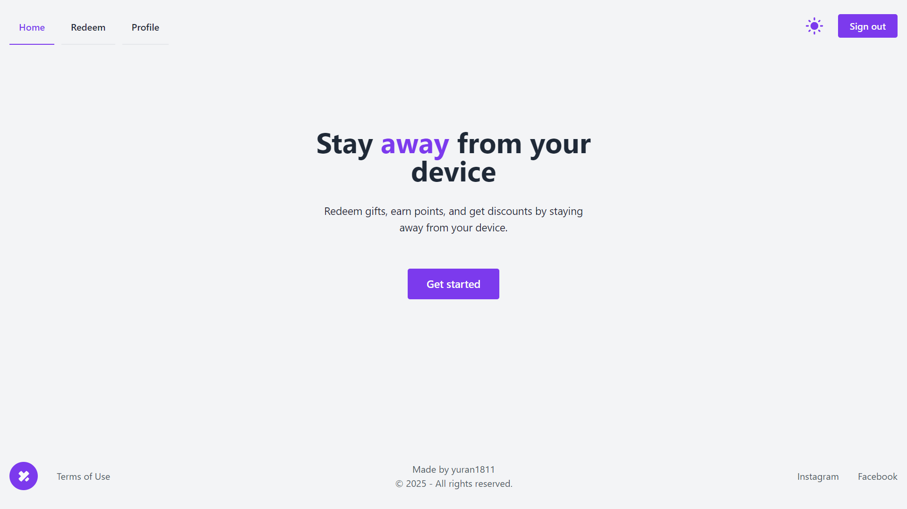
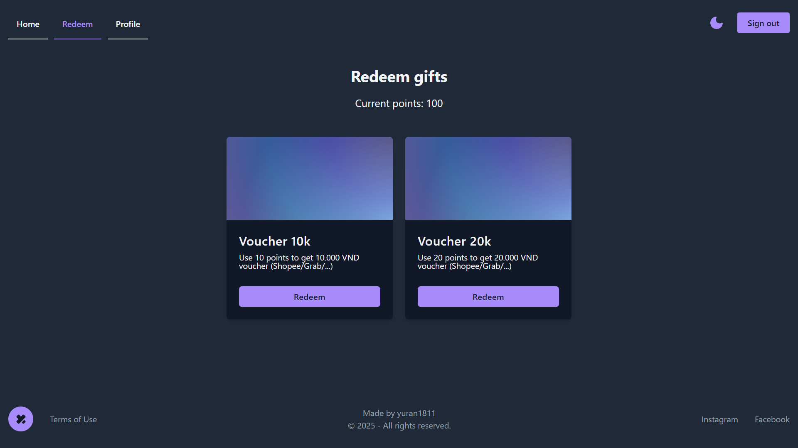
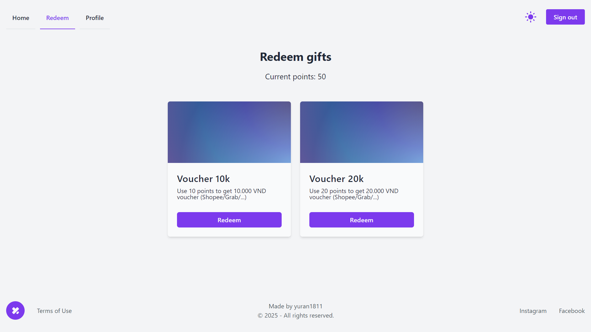
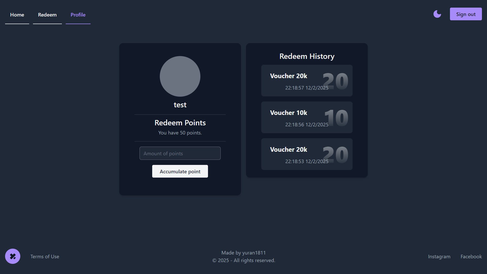
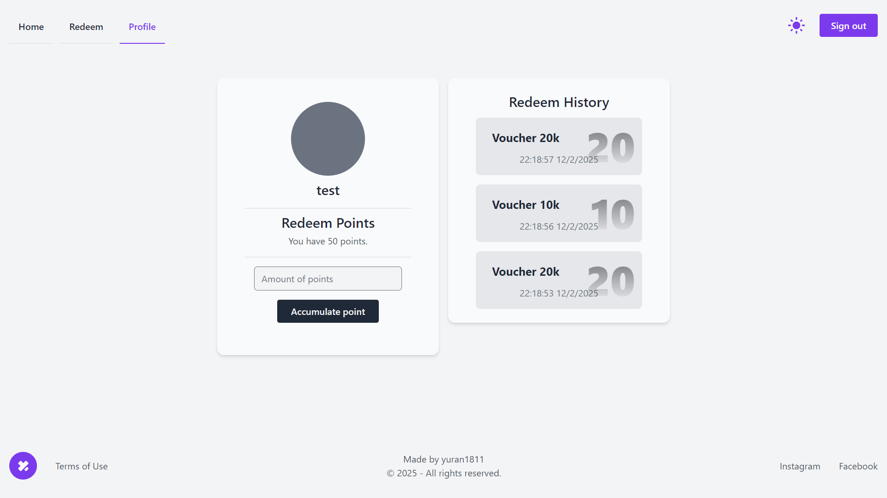
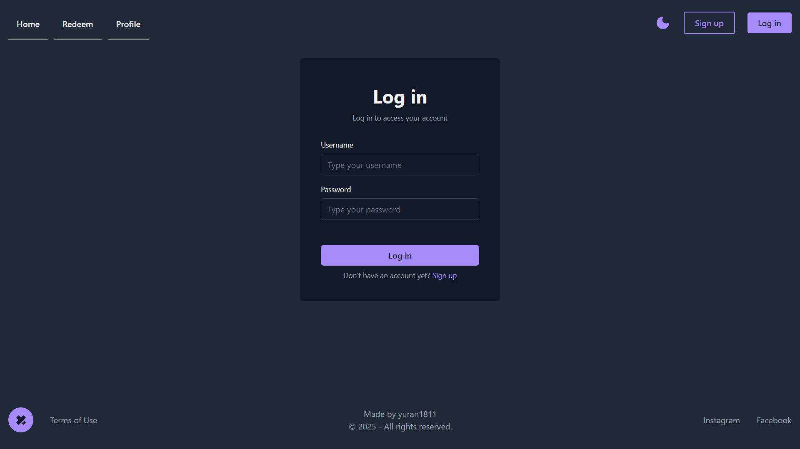
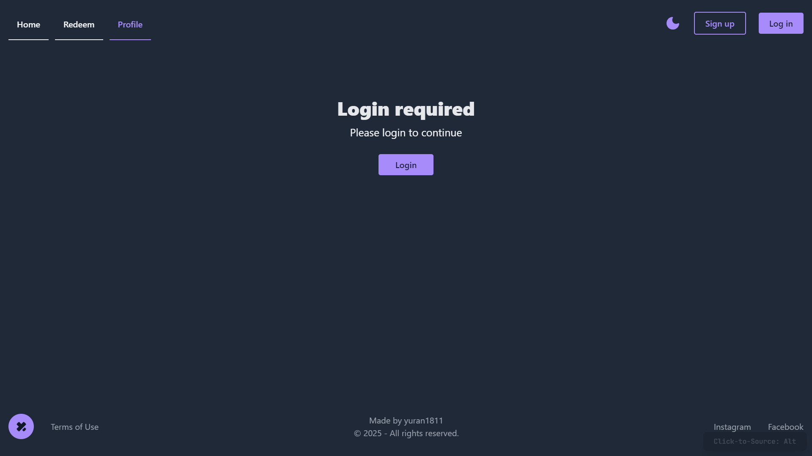
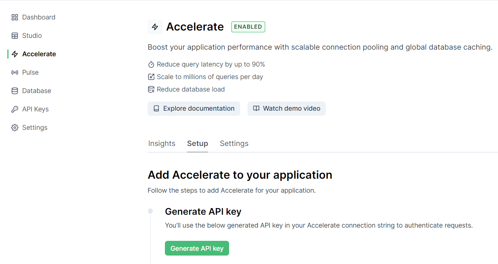

<h1 align="center">Qwik Demo App</h1>
<p align="center" style="font-size:16px"><strong></strong></p>
<p align="center">  
  
</p>

<p align="center">
  
  
  
  
  
</p>

<div align="center"><a href="https://qwik-demo-app-iota.vercel.app/" target="_blank">Live Demo</a></div>

## Introduction

- `qwik-demo-app` is an open-source Qwik application with Prisma, TailwindCSS, Typescript.

## Features

- [x] Authentication with Auth.js
- [x] Prisma (with acceleration) + Supabase
- [x] Redeem gifts + redeem history
- [x] User profile and accumulate points

## Tech Stack


## Screenshots

<div style="display:flex;gap:12px;justify-content:center">
    
    
</div>

<div style="display:flex;gap:12px;justify-content:center">
    
    
</div>

<div style="display:flex;gap:12px;justify-content:center">
    
    
</div>

<div style="display:flex;gap:12px;justify-content:center">
    
    
</div>

## Quick Start

Follow these steps to set up the project locally on your machine.

**Prerequisites**

Make sure you have the following installed or downloaded on your machine:

- [Git](https://git-scm.com/)
- [Node.js](https://nodejs.org/en)

**Cloning the Repository**

```bash
git clone https://github.com/yuran1811/qwik-demo-app.git
cd qwik-demo-app
```

**Prepare env variables**

- Goto [Prisma Console](https://console.prisma.io/), create new project and enable the `Acceleration` feature
- Generate API key and copy it
  
- Back to terminal, create new `.env` file from `.env.example`

```bash
cp .env.example .env
```

- Paste the copied API key to the `DATABASE_URL` and `VITE_DATABASE_URL` fields

```bash
DATABASE_URL="prisma://accelerate.prisma-data.net/?api_key=..."
VITE_DATABASE_URL="prisma://accelerate.prisma-data.net/?api_key=..."
```

**Installation**

- Enable `pnpm` to build and run the project

```bash
corepack enable pnpm
```

Install the project dependencies:

```bash
pnpm install
```

**Running the Project**

```bash
pnpm dev
```

Open [http://localhost:5173](http://localhost:5173) in your browser to view the project.

## References

- [Vercel Edge](./md/vercel-edge.md)
- [Prisma Integration](https://qwik.dev/docs/integrations/prisma/)
- [Typesafe form](https://www.builder.io/blog/type-safe-forms-in-qwik)
- [Interact with Arduino](https://www.youtube.com/watch?v=gQYsUjT-IBo)
